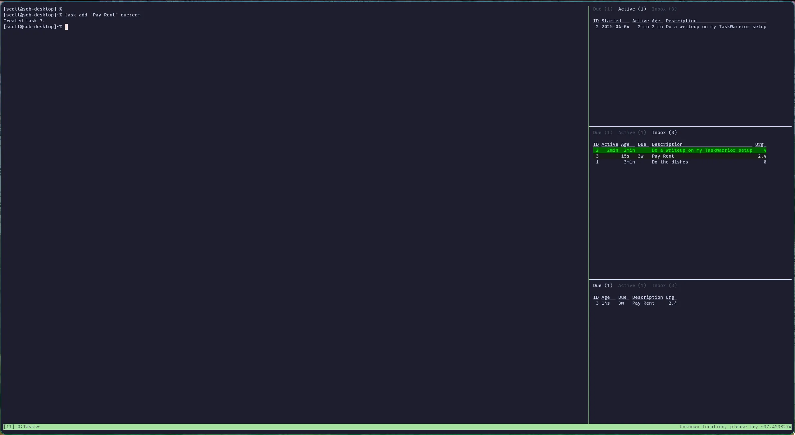

# Taskwarrior-summary

A very small utility for showing Taskwarrior tasks in a small terminal window.  Mouse support to switch between:
- Due
- Active
- Inbox

Works well with TMUX resurrect
```
## TMUX Resurrect
set -g @plugin 'tmux-plugins/tmux-resurrect'
set -g @resurrect-processes '"~tasks-dash_active" "~tasks-dash_due" "taskwarrior-summary"'
```


